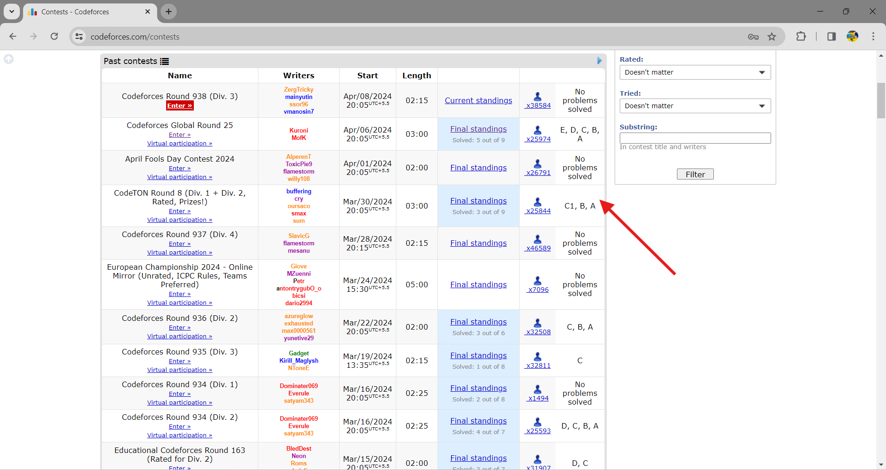

## Codeforces Handle
Make sure to change the handle to your Codeforces handle in the following line of code (My codeforces handle is tomatoSword):
```javascript
const data = await fetchSubmissionsWithRetries(contestId, 'tomatoSword');
```
here's the output: 
##
 
###
